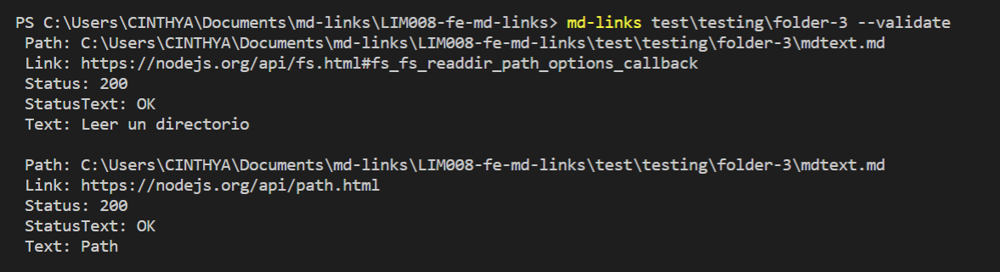
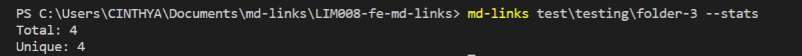
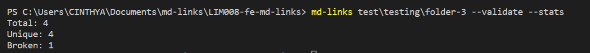
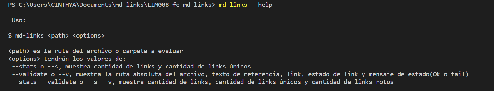
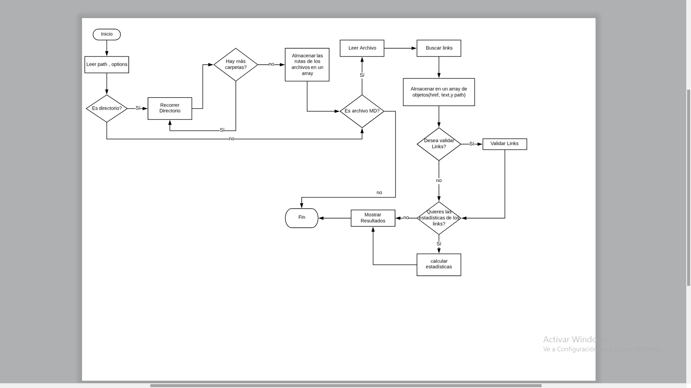
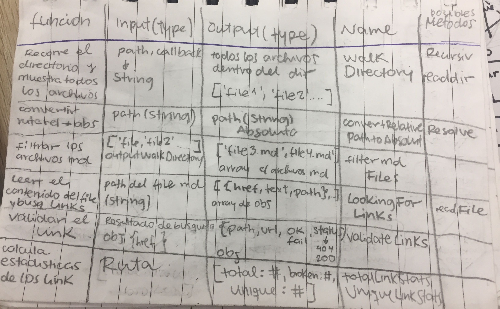
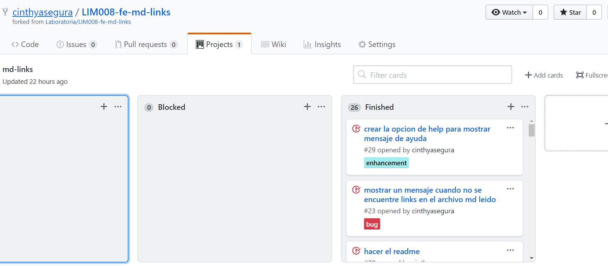
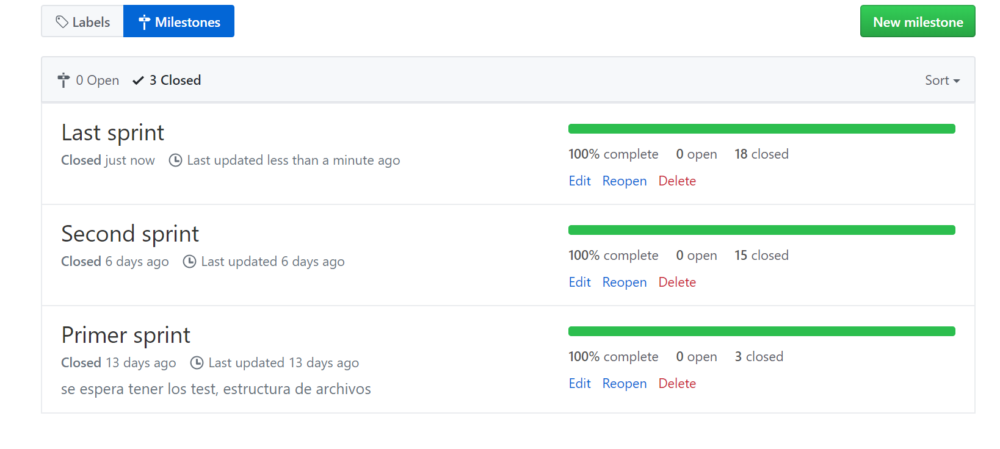

# Información

`md-links` herramienta que lee y analiza archivos
en formato `Markdown`, para verificar los links que contengan y reportar
algunas estadísticas.

# Instalación

Para instalar esta librería debemos ejecutar el siguiente comando

`npm i cinthyasegura/md-links`

## Uso en la línea de comandos
El ejecutable podra ejecutarse de la siguiente manera a través de la terminal:

`md-links <path-to-file> [options]`

Por ejemplo:

```sh
$ md-links ./some/example.md --validate
$ md-links ./some/example.md --stats
$ md-links ./some/example.md --v --s
```

## Opciones
`--validate o --v`

Si pasamos la opción --validate o --v, el módulo debe hacer una petición HTTP para averiguar si el link funciona o no. Si el link resulta en una redirección a una URL que responde ok, entonces consideraremos el link como ok.



El _output_ en este caso incluye la palabra `ok` o `fail` después de
la URL, así como el status de la respuesta recibida a la petición HTTP a dicha
URL.

`--stats o --s`

Si pasamos la opción --stats o --s el output (salida) será un texto con estadísticas básicas sobre los links.




`--stats --validate` 

También podemos combinar --stats y --validate para obtener estadísticas que necesiten de los resultados de la validación.



`--help`

Te mostrara las posibles opciones que podras utlizar




### Ejecutable 

El módulo puede importarse en otros scripts de Node.js a travéz de:

`require('md-links')`

#### `mdLinks(path, options)`

##### Argumentos

- `path`: Ruta absoluta o relativa al archivo o directorio
- `options`: Un objeto con las siguientes propiedades:
  * `validate`: Booleano que determina si se desea validar los links encontrados.


## Implemetación de la librería

Se crea el flujograma para tener una guía de la implementación del proyecto


Adicionalmente se crea un cuadro con las funciones a crear, input, output y los posibles métodos a implementar


Se hizo uso de las herramientas de GitHub para la organización y planificación del proyecto como los milestone, issues, project.

Project:


Milestone:


